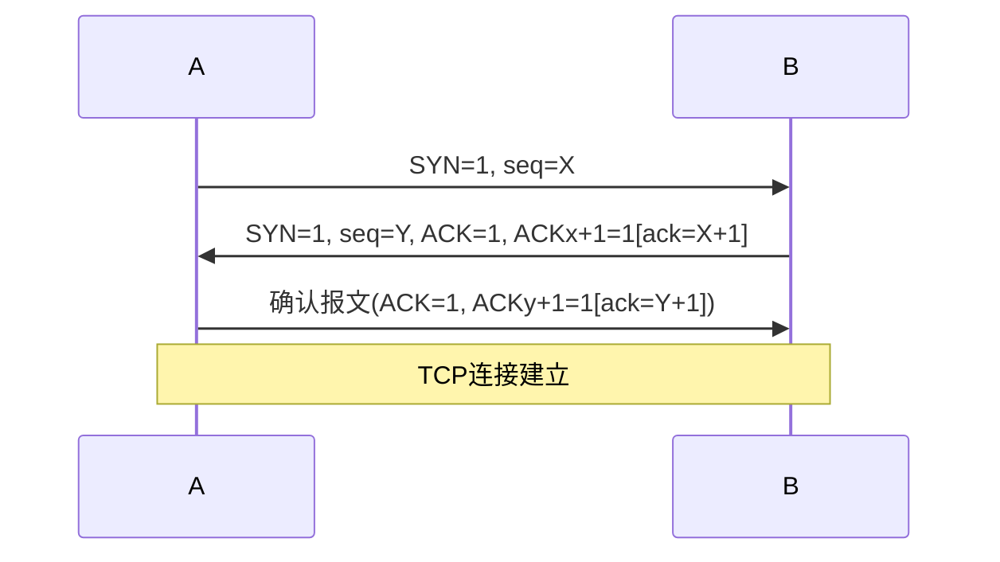

<span style="font-size: 45px;">  👻</span>

# TCP 
## 报文
### 端口
  - <span style="color: purple;">不同</span>计算机的 相同<span style="color: blue;">端口</span>号 <span style="color: green;">没有联系
### <span style="color: deepskyblue;">首部</span>
  - 窗口字段的值 → 自己接收窗口的尺寸 
### <span style="color: orange;">报文</span>段
- 对<span style="color: orange;">报文</span>段的确认机制
  -  TCP是面向字节的，对每个字节都进行编号
  -  并不是对接收到的每个字节都要发回确认
     - 收到整个报文段后 → 一个ack
## 连接
### <span style="color: green;">ACK</span>、<span style="color: orange;">SYN</span>、**FIN**=**1**
### 三次handshake
- eg;
  - 设A、B双方发送报文的初始序列号分别为X和Y
    - A发送(①)的报文给B,B接收到报文后发送(②)的报文给A
      -  B 接收到报文后，
         -  发给 A 的确认报文段中应使 
            -  SYN = 1, 使 ACK = 1，且确认号ack = X + 1
            -  即 $\color{green}{ACK}\color{purple}_{X+1}\color{black} = 1$（ACK 的下标为携带的序号），同时告诉自已选择的序号 $\color{blue}seq\color{black} = Y$
      - (ACK的下标为捎带的序号)
      - A发送一个确认报文给B便建立了连接

- standard
  - <span style="color: orange;">SYN</span>=1,&emsp;&emsp;&emsp; seg=x 
  - &emsp;&emsp;~ , <span style="color: green;">ACK</span>=1,seq=y, ack=x+1 
  - &emsp;&emsp;×,&emsp;~&emsp;&emsp; ,seq=x+1,ack=y+1 
  - 
- 第三个报文
  - as above, 对$ ( ( 建立连接的\color{orange}请求\color{black}^① ) 的\color{green}确认\color{black}^② )的\color{green}确认^③$
### 标志位(<span style="color: green;">ACK</span>、<span style="color: orange;">SYN</span>、**FIN**=**1**)&序号字段(seq/ack)
- explanation
  - 标志位(ACK/SYN/FIN)像开关，只有开(1)和关(0)
  - 序号和确认号像数值，可以是具体的数字


#### <span style="color: green;">ack
- point接收方 希望<span style="color: purple;">next</span>收到的报文段的数据部分 <span style="color: blue;">第一个</span>字节 的编号
  - → get确认号为<span style="color: deepskyblue;">100</span>的确认报文段
    - <span style="color: gray;">→ 接收方希望下一个收到的报文段的数据部分的第一个字节编号为</span>100
    - <span style="color: purple;">末</span>字节序号为<span style="color: green;">99</span>的报文段 已收到
#### <span style="color: purple;">seq
- ==第一个报文段== 不能携带数据，but<span style="color: green;">消耗</span>一个seq
  - 甲给乙发送的<span style="background-color: lightgreen;"> 第二个</span>报文段(第三次握手)的序号是201
    - 该报文段可以携带数据
    - <span style="color: green;">不携带</span>数据，==不==<span style="color: green;">消耗</span>seq
#### <span style="color: purple;">seq & <span style="color: green;">ack
- es0:
  - A → B  seq=200, ack=201,数据部分有2个字节
    - 则B?
  解：
      - seq值应和A发向 B的报文中的 ack 值相同，即201
      - ack 值
        - 表示B期望下次收到A发出的报文段的第一个字节的编号(以sqe为standard)
        - 应是200+2=202
    - tips:
      - <span style="color: blue;">seq</span>_B 同<span style="color: green;">ack</span>_A;
      - <span style="color: green;">ack</span>_B以<span style="color: blue;">sqe</span>_A为起始
    - details
      - seq 表示发送的报文段中
        - 数据部分的第一个字节在 $A$ 的发送缓存区中的编号
      - ack 表示A期望收到的
        - 下一个报文段的数据部分的第一个字节在 $B$ 的发送缓存区中的编号
- es1:
  - 甲 → 乙： 
    - 3个连续的TCP段，分别包含200字节、300字节、400字节的有效载荷
    - 第3个段的<span style="color: purple;">seq </span>为1000
  - 若乙仅正确接收到第1个和第3个段
    - 乙发送给甲的 <span style="color: green;">ack</span> ?
  
  解
    - 乙下次期望收到2nd → 需要发送的ack即2nd的seq
    - 2个段的序号为$1000-300=700$
      - ⬆️3rd<span style="color: deepskyblue;">起始</span>序号 - 2nd的<span style="color: blue;">length</span>

## <span style="color: green;">释放
- 进程中的<span style="color: purple;">any</span>一个都能提出释放连接的请求
### ~' ==最短==时间
- t时刻TCP客户请求断开连接，则从t时刻起TCP服务器~
  - (TCP客户与TCP服务器的通信已结束，端到端的往返时间为RTT)

解
-  t时刻TCP客户请求断开连接，发出连接释放 FIN报文段：
   -  题目问的是最短时间，所以当TCP<span style="color: green;">sever</span>收到TCP客户发来的FIN 报文段后**不再发送**数据，
   -  因此
      -  同时发出确认 ACK报文段和连接释放FIN报文段，即直接跳过CLOSE-WAIT状态；
      -  TCP客户收到FIN报文段后必须发出确认;
      -  TCP服务器收到确认后就进入CLOSED状态
   -  共经历1.5个RTT
-  即
   -  
-  standard
  - 
图5.8用"四次挥手"释放TCP连接  
## 控制

### <span style="color: green;">r</span>wnd
- rwnd &emsp;&emsp;cwnd  &emsp;&emsp;ssthresh
- 接收窗口  拥塞窗口   慢开始门限
  - <span style="color: green;">r</span>wnd 即**接收方** 允许**连续接收**的**能力**
### <span style="color: deepskyblue;">s</span>wnd 
- <span style="color:deepskyblue;">s</span>wnd 的值 → 可发送窗口的尺寸
  - swnd值由1000变为2000 → 可send 2000
    - (no matter 确不确认)
- 依据：swnd=min[rwnd，cwnd]

### <span style="color: orange;">c</span>wnd
- <span style="color: deepskyblue;">Send</span>端 根据网络拥塞情况确定的窗口值
- 大小
  - 在开始时can按指数规律增长

#### <span style="color: green;">计算</span>
##### <span style="color: orange;">慢</span>开始 & 拥塞<span style="color: green;">避免</span>
##### <span style="color: blue;">method</span>
- 无论在慢开始阶段还是在拥塞避免阶段，只要发送方**判断** **网络**出现<span style="color: orange;">拥塞</span>：
  - ①令
    - **ssthresh** = <span style="color: orange;">c</span>wnd * 0.5 ← <span style="color: gray;">乘法减小</span>
    - <span style="color: orange;">c</span>wnd = 1MSS
  - ②慢开始算法
    - 指数增长 cwnd = cwnd * 2
- 整体:
    - ```mermaid
      flowchart TD
      A[开始] --> B[初始化: cwnd=α, ssthresh=β]:::whitetext
      B --> C{cwnd < ssthresh?}:::whitetext
      C -->|Y| D[指数增长: cwnd = cwnd * 2]:::whitetext
      C -->|N| E[线性增长: cwnd = cwnd + 1]:::whitetext
      D --> F{是否发生拥塞?}
      E --> F
      F -->|Y| G[ssthresh = cwnd/2 <br> cwnd = 1]:::whitetext
      F -->|N| C
      G --> C
      classDef whitetext fill:#fff
    - 无ssthresh_init时:
      - 
    - 有ssthresh_init时:
      - 
- es0
  - MSS为1KB,当拥塞窗口为<span style="color: blue;">34KB</span>时发生了超时事件
    - 若在接来的**4**个**RTT**内报文段传输都是成功的
    - 则当这些报文段均得到确认后
  - <span style="color: orange;">c</span>wnd size?
  
  解
    ```Python
   
    MSS = 1  # KB
    initial_cwnd = 34  # KB
    RTT_count = 4
    #解# 
    # 发生超时后的计算
    ssthresh = initial_cwnd / 2  # = 17KB
    cwnd = 1  # 重置为1个MSS

    # ⚠️4个RTT的演变过程 ← 慢开始
    RTT_1: cwnd = 1 * 2 = 2KB    # 指数增长
    RTT_2: cwnd = 2 * 2 = 4KB    # 指数增长  
    RTT_3: cwnd = 4 * 2 = 8KB    # 指数增长
    RTT_4: cwnd = 8 * 2 = 16KB   # 指数增长

    # 最终结果
    final_cwnd = 16  # KB < ssthresh(17KB)

        # 验证:
        # 1. 始终在慢启动阶段(cwnd < ssthresh)
        # 2. 每个RTT窗口大小翻倍
        # 3. 最终窗口未超过ssthresh,仍在慢启动阶段
  ```

### <span style="color: deepskyblue;">滑动</span>wnd
- ~是一种实现<span style="color: green;">流量</span>控制的方法
  - 不是拥塞控制的方法
    - 其机制中用到了滑动窗口
      - 这并不是~ 的作用
- <span style="color: purple;">重传</span>分组的数量
  - (at most) =<span style="color: deepskyblue;">滑动</span>wnd size
- 值设置太大
  - 数据过多→路由器拥挤
  - 主机可能丢失分组
## TCP与UDP
### <span style="color: deepskyblue;">首部
- TCP和UDP首部均含检验和
  - TCP检验和不仅检验数据，还检验TCP首部
  - UDP检验和仅检验数据
- TCP首部独有的是 **seq** 和 **ack**
#### <span style="color: purple;">伪<span style="color: deepskyblue;">首部</span>
##### 伪首部协议字段
- 用于指明上层协议是TCP还是UDP
  - 17 → UDP
  - 6 → TCP
##### 首部&伪首部' <span style="color: orange;">区别
核心区别：
- **伪首部**是为了计算校验和而设计的临时结构，<span style="color:green;">不参与</span>实际传输
  - 包含了IP层的信息(源IP和目的IP)
- **首部**是**实际传输**数据包的组成部分
  - 首部不包含~